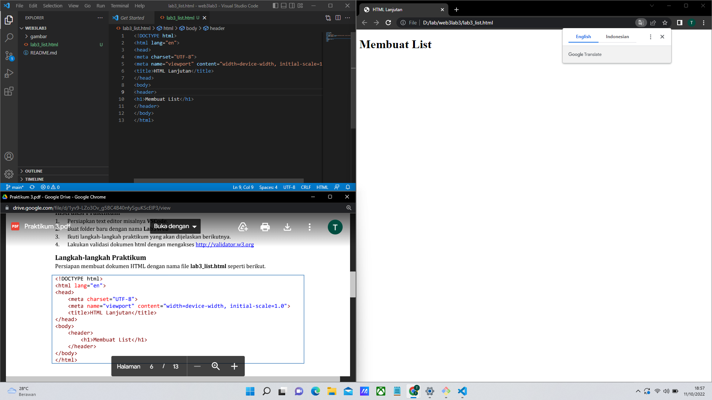
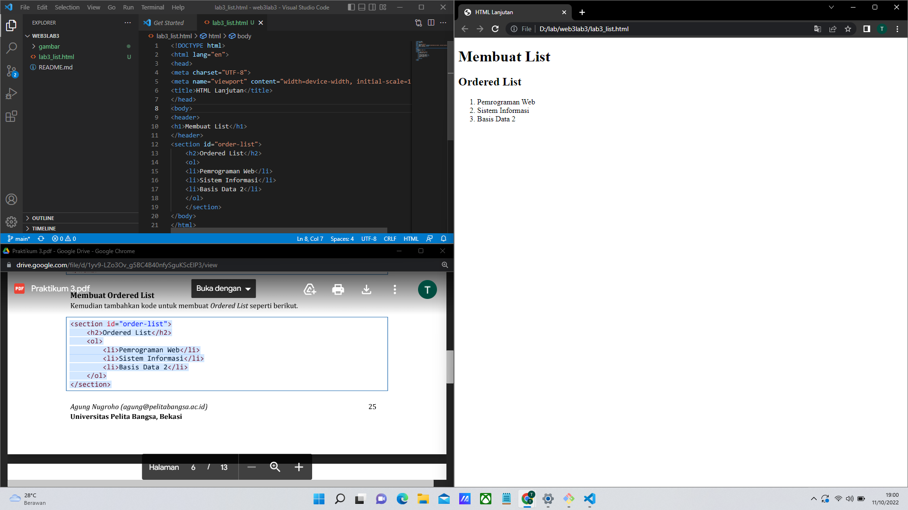
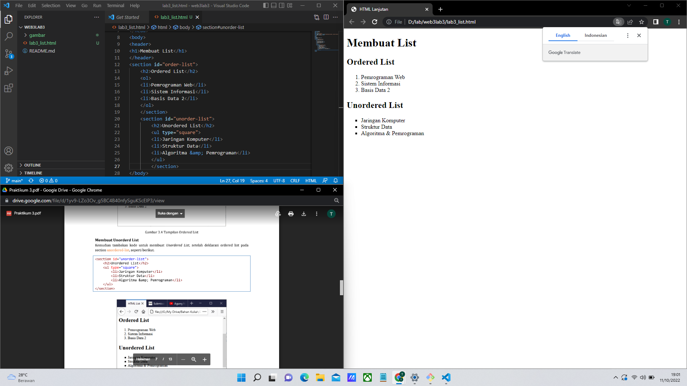
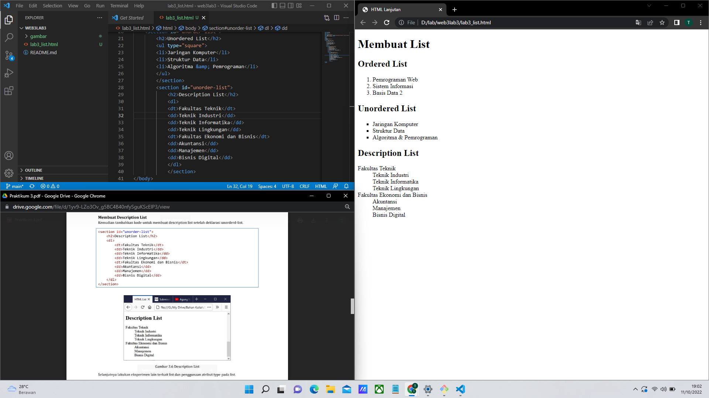
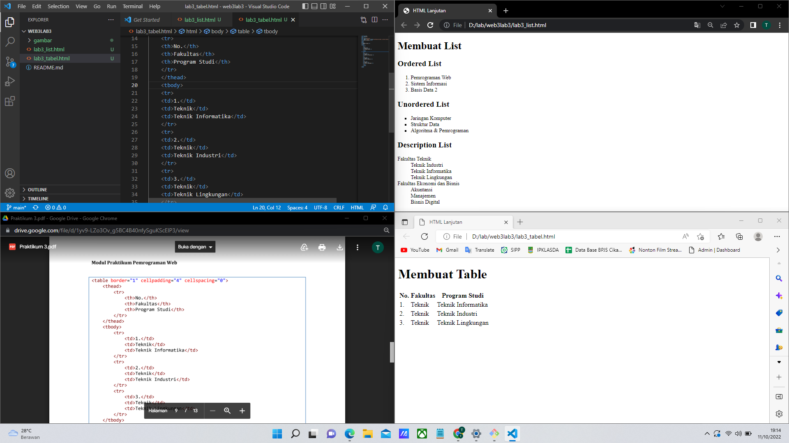
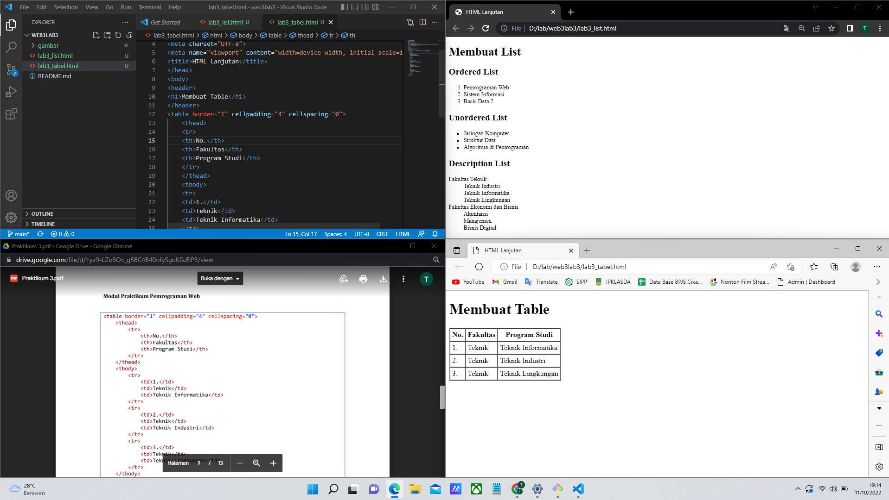
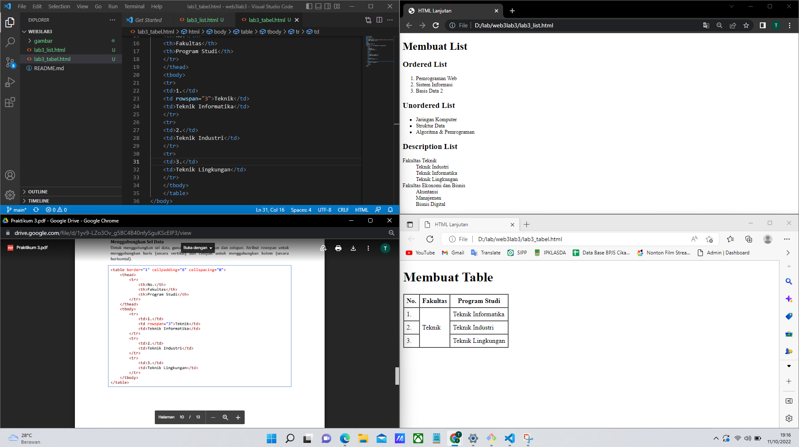
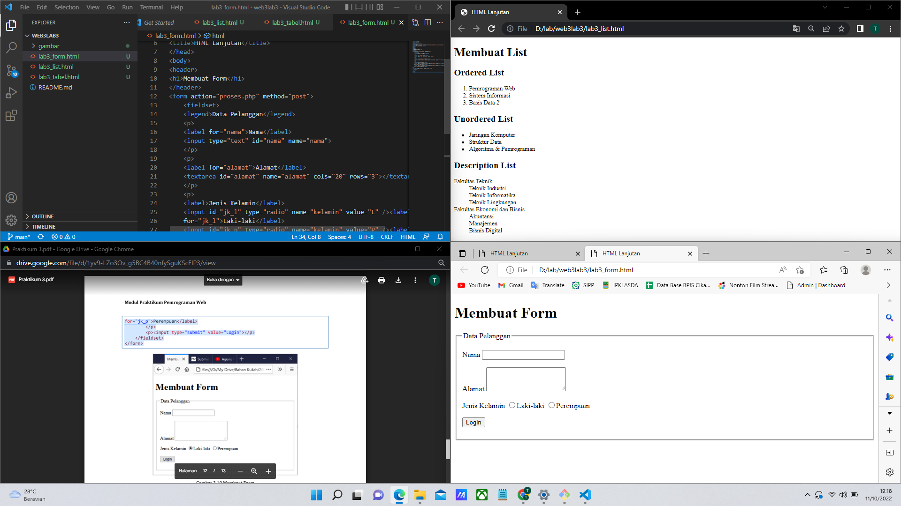
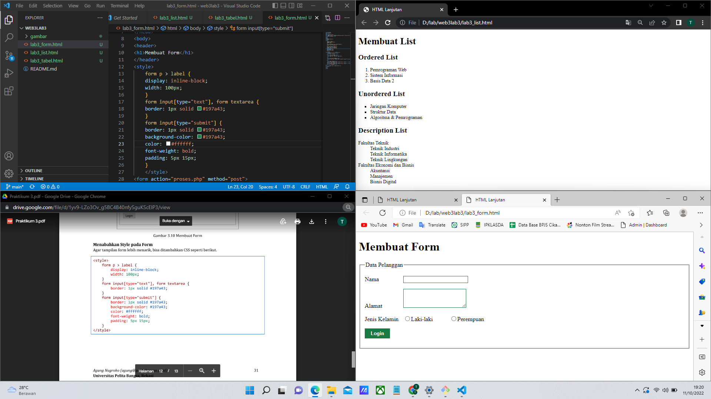

# web3lab3
### Membuat list html ###
langkah pertama silahkan membuat file dengan nama lab3_list.html , seperti pada gambar di bawah

### membuat ordered list ###
Kemudian tambahkan kode untuk membuat Ordered List seperti  pada gambar di bawah

### membuat unorderd list ###
Kemudian tambakan kode untuk membuat Unordered List, setelah deklarasi ordered list pada
section unordered-list, seperti gambar berikut

### membuat description list ###
Kemudian tambahkan kode untuk membuat description list setelah deklarasi unorderd-list. seperti gambar berikut 

### Membuat tabel html ###
Buat file baru dengan nama lab3_tabel.html , Kemudian selanjutnya tambahkan kode untuk membuat tabel sederhana seperti gambar berikut.

### Mengatur Margin dan Padding ###
Untuk mengatur margin dan padding pada cel data, tambahkan atribut cellpadding dan
cellspacing pada tag table.
<table border="1" cellpadding="4" cellspacing="0"> seperti gambar di bawah

### Menggabungkan Sel Data ###
Untuk menggabungkan sel data, gunakan atribut rowspan dan colspan. Atribut rowspan untuk
menggabungkan baris (secara vertikal) dan colspan untuk menggabungkan kolom (secara
horizontal). seperti gambar di bawah

### Membuat Form html ###
Buat file baru dengan nama lab3_form.html, Kemudian selanjutnya tambahkan kode untuk membuat tabel sederhana seperti gambar di bawah ini 

### Menabahkan Style pada Form ###
Agar tampilan form lebih menarik, bisa ditambahkan CSS seperti gambar pada di bawah ini

